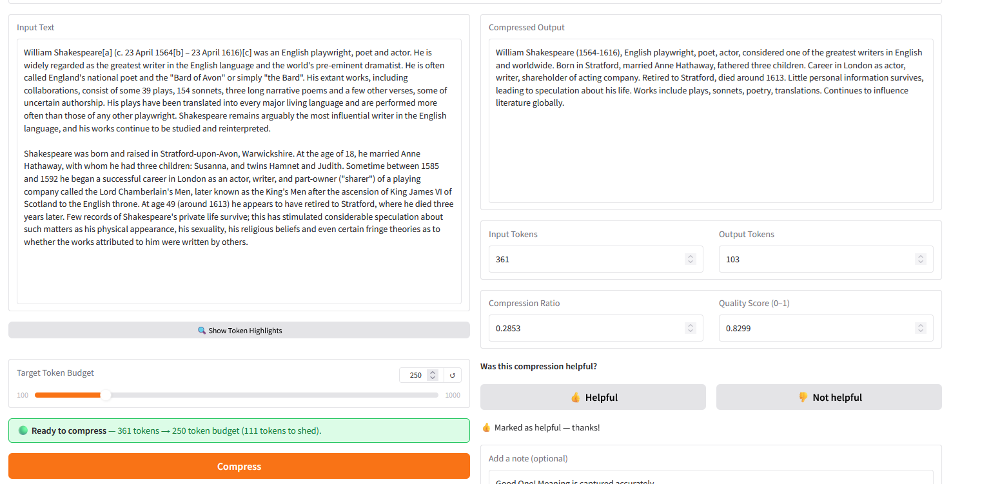
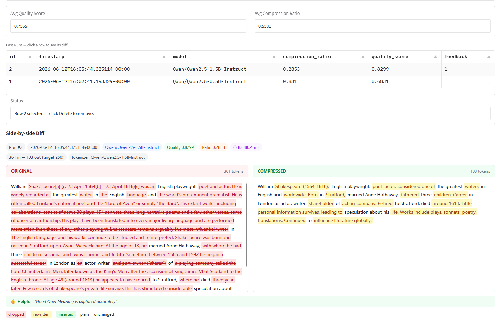

# TinyPress — Prompt Compression Engine

> **HuggingFace Build Small Hackathon · Track: Thousand Token Wood**

The constraint *is* the feature. Give TinyPress a long piece of text, set a token budget, and get back a compressed version that still carries the meaning — scored, saved, and diffed so you can see exactly what was kept and what was shed.

No cloud. No API bill. Two small models running quietly on your machine.

---

## Demo

[](https://youtu.be/hDbIDtjjiB0)

---

## Why this fits Thousand Token Wood

Working inside a tight token budget is not a limitation to work around — it is the problem worth solving. LLM context windows are finite, prompt costs are real, and bloated inputs degrade output quality. TinyPress treats the token count as a hard constraint and makes compression the primary interaction: you set the budget, the model meets it, and a quality score tells you how much meaning survived.

---

## Features

| | |
|---|---|
| 🗜️ **Token-budget compression** | Set a target (100–1000 tokens) and compress to exactly that budget |
| 📊 **Quality score** | Cosine similarity between original and compressed text — 0 to 1, higher is better |
| 🟢🔴 **Live readiness banner** | Green when input is over budget and compression will run; red when already within budget |
| 🔍 **Token highlight panel** | Every token rendered as a colour-coded chip so you can see where your budget is going |
| 🔀 **Model hot-swap** | Switch the compression LLM mid-session without a restart (5 curated models, or any HF model ID) |
| 🎯 **Embedder hot-swap** | Switch the scoring embedder with per-model trade-off info (speed vs quality vs RAM) |
| 👍👎 **Feedback capture** | Rate every result, add an optional text note — saved instantly to SQLite |
| 📜 **Run history** | Every compression persisted locally with full metrics and configurable column visibility |
| 🔎 **Side-by-side diff** | Word-level colour diff — dropped (red), rewritten (amber), inserted (green), unchanged (plain) |

---

## Preview






---

## Models

| Role | Default | Alternatives |
|---|---|---|
| Compression LLM | `Qwen/Qwen2.5-1.5B-Instruct` | Qwen2.5-0.5B, SmolLM2-1.7B, Phi-3.5-mini, Llama-3.2-1B |
| Quality scorer | `sentence-transformers/all-MiniLM-L6-v2` | mpnet-base, bge-small, bge-base, mxbai-large, gte-Qwen2-1.5B |

All models are open-weight and under 32B. Everything runs locally — no API calls, no data leaves your machine.

---

## Get started

```bash
python -m venv .venv
# Windows
.venv\Scripts\activate
# macOS / Linux
source .venv/bin/activate

pip install -r requirements.txt
python app.py
```

Open `http://localhost:7860`. That's it.

**Run it in Colab:** open `tinypress_colab.ipynb` — it installs dependencies, loads the models, and launches a public Gradio share URL. GPU runtime recommended for faster inference.

Optional environment overrides:

| Variable | Default | Description |
|---|---|---|
| `LLM_MODEL` | `Qwen/Qwen2.5-1.5B-Instruct` | Compression model |
| `EMBEDDER_MODEL` | `sentence-transformers/all-MiniLM-L6-v2` | Scoring embedder |
| `DB_PATH` | `tinypress.db` | SQLite database path |
| `PORT` | `7860` | Gradio server port |

---

## Hardware

| | Minimum | Recommended |
|---|---|---|
| RAM | 8 GB | 16 GB |
| VRAM | CPU-only works | 4 GB GPU speeds up inference |
| Disk | ~4 GB | ~4 GB |

---

## Architecture

```
Input text + token budget
        │
  core/compressor.py     — builds prompt, calls LLM, hard-trims if it overshoots
        │
  models/model_loader.py — Qwen2.5-1.5B (or swapped model), loaded once, reused
        │
  core/scorer.py         — cosine similarity via sentence-transformer embedder
        │
  db/store.py            — saves run to SQLite
        │
  ui/compress_tab.py     — shows result, metrics, feedback UI
```

Thin UI layer — Gradio handlers pass inputs to `core/`, return outputs. All logic lives in `core/` and `db/`.

Full docs: [Architecture](docs/architecture.md) · [Setup](docs/setup.md) · [Get Started](docs/get-started.md) · [Folder Structure](docs/folder-structure.md)

---

## About

Built by **[Sriharsha C R](https://www.linkedin.com/in/sriharsha-cr)** — AI Engineer and Cloud Native developer.

[](https://www.linkedin.com/in/sriharsha-cr)
[](https://x.com/sriharsha_cr)
[](https://huggingface.co/sriharsha-cr)
[](https://github.com/SriharshaCR)
